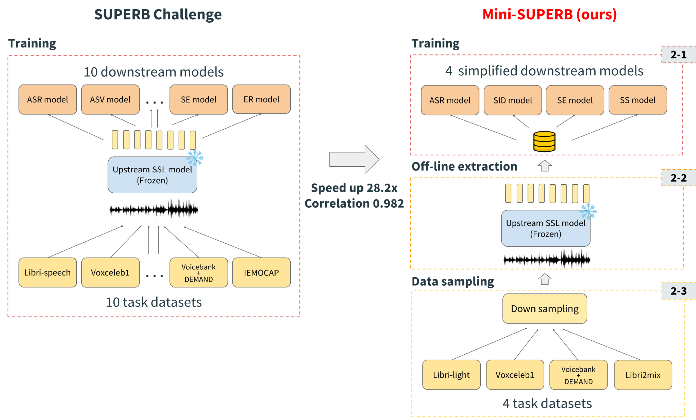
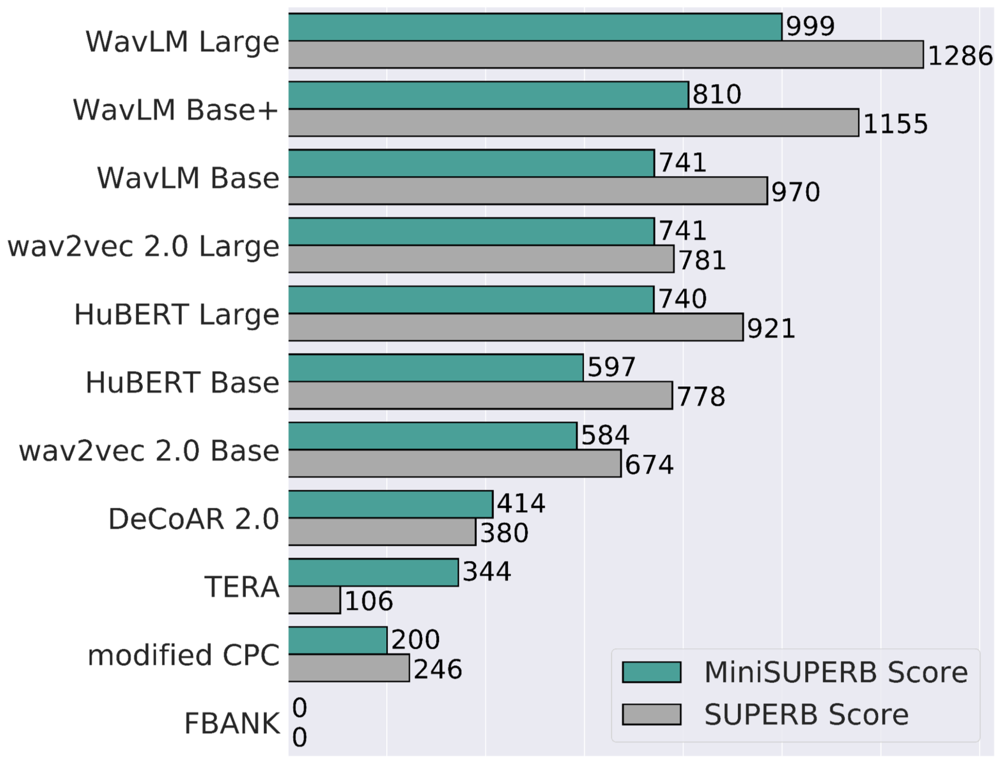

# MiniSUPERB
 **NOTE: This repository is still under development. Some features may not be fully functional.**

MiniSUPERB is a proxy dataset for [SUPERB and the SUPERB Challenge](https://superbbenchmark.org/). It provides a simplified and accessible way to evaluate SSL speech models.

The following diagram provides an intuitive illustration of how MiniSUPERB accelerates the evaluation process for SSL speech models:


The figure shows how our results approximate the model rankings of the SUPERB Challenge:


For more details, please refer to the [original paper](https://arxiv.org/abs/2305.19011).

## Environment compatibilities

The project was developed using the following environments.

| Env | versions |
| --- | --- |
| os  | `ubuntu-20.04` |
| python | `3.10` |
| pytorch | `1.12.1` |

## Introduction and Usages

MiniSUPERB supports four downstream tasks:
- Automatic Speech Recognition (ASR)
- Speaker Idendification (SID)
- Speech Enhancement (SE)
- Source Separation (SS)

The following upstream models are supported:
| Models       | Upstream Model Name                      | Paper                                     |
|--------------|------------------------------------------|-------------------------------------------|
| WavLM        | wavlm_base, wavlm_base_plus, wavlm_large | [arxiv](https://arxiv.org/abs/2110.13900) |
| HuBERT       | hubert_base, hubert_large_ll60k          | [arxiv](https://arxiv.org/abs/2106.07447) |
| Wav2Vec 2.0  | wav2vec2, wav2vec2_large_ll60k           | [arxiv](https://arxiv.org/abs/2006.11477) |
| Modified-CPC | modified_cpc                             | [arxiv](https://arxiv.org/abs/2002.02848) |
| TERA         | tera                                     | [arxiv](https://arxiv.org/abs/2007.06028) |
| DeCoAR 2.0   | decoar2                                  | [arxiv](https://arxiv.org/abs/2012.06659) |
| Filter Bank  | fbank, fbank_no_cmvn (used for SID)      |                                           |

## Usage

Start a new downstream training experiment with the following command:

```bash
cd minisuperb

# To evaluate a model on ASR:
bash asr.sh UpstreamModelName DataStorage

# To evaluate a model on SID:
bash sid.sh UpstreamModelName DataStorage

# SE and SS are currently under development:
# To evaluate a model on SE:
bash se.sh UpstreamModelName DataStorage

# To evaluate a model on SS):
bash ss.sh UpstreamModelName DataStorage
```

## Installation

1. Install **sox** on your OS
2. Install dependencies `pip install -e ".[all]"`


## License

The majority of this project is licensed under the Apache License version 2.0, however all the files authored by Facebook, Inc. (which have explicit copyright statement on the top) are licensed under CC-BY-NC.
